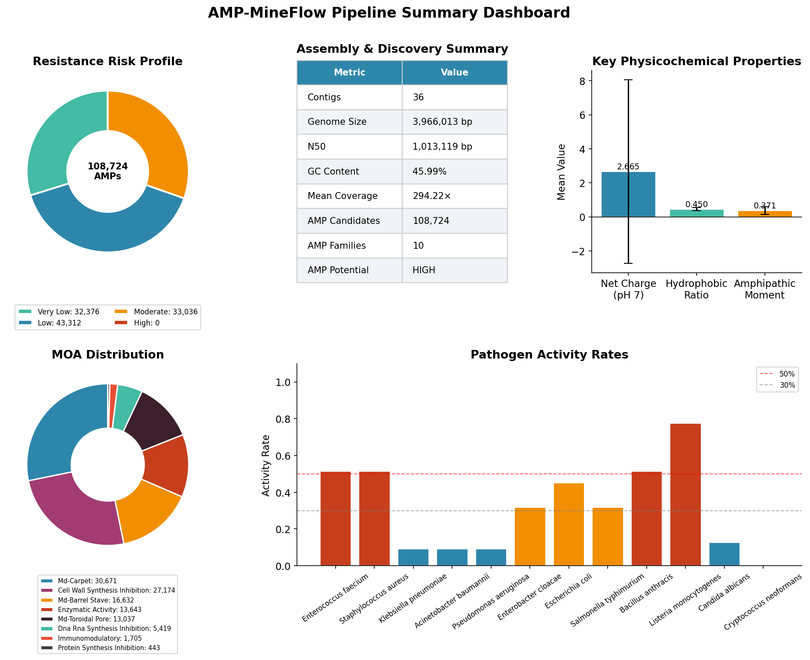
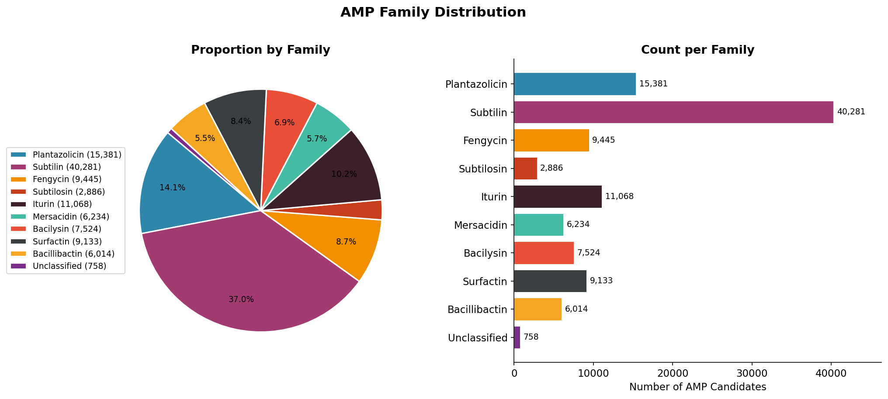
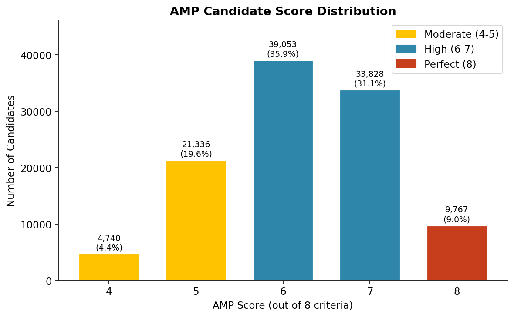
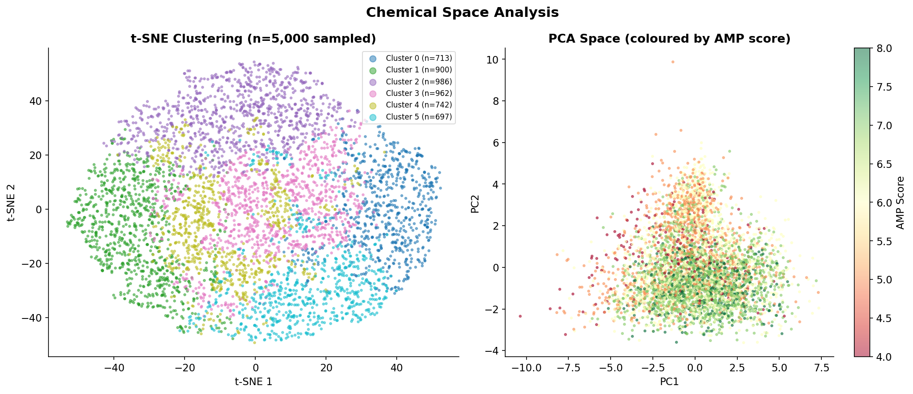
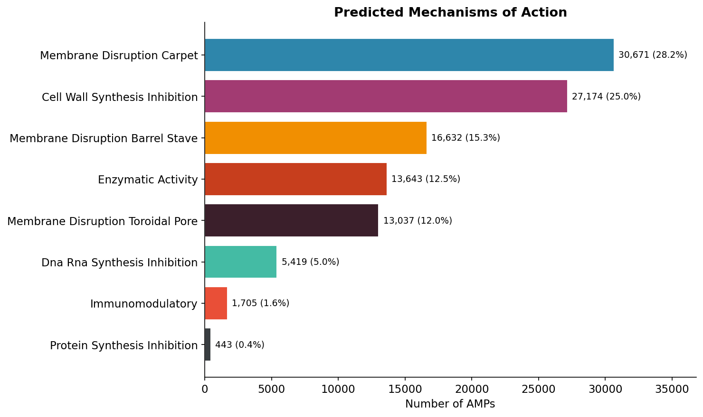
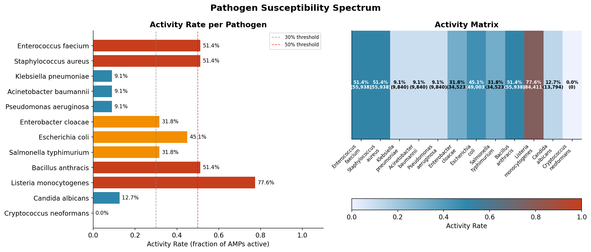
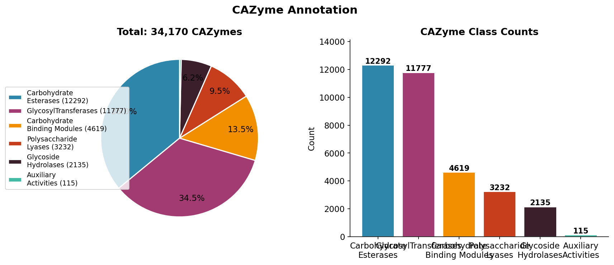
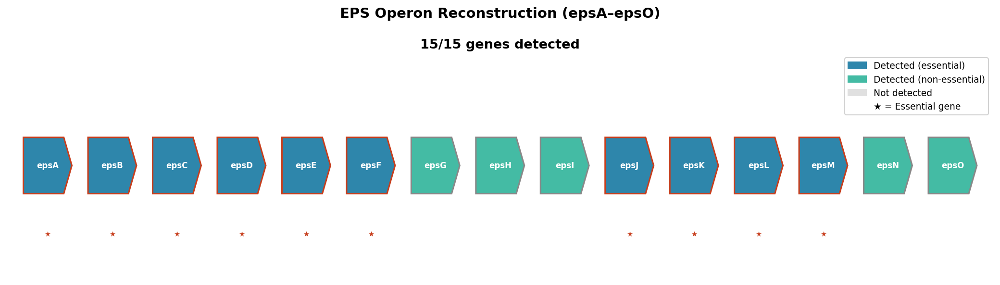
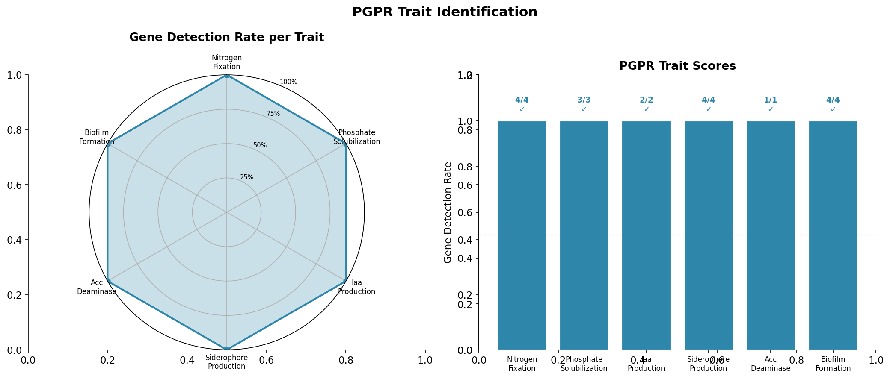

<div align="center">

# 🧬 AMP-MineFlow ⚔️

### *Genome-Scale Antimicrobial Peptide Mining & Multi-Functional Analysis Pipeline*

[](https://www.nextflow.io/)
[](https://python.org)
[](LICENSE)
[]()
[]()

<br>

> **AMP-MineFlow** is a fully automated, reproducible Nextflow DSL2 pipeline that takes a raw bacterial genome assembly and performs 14 chained analysis phases — from ORF prediction and AMP screening to CAZyme annotation, EPS pathway reconstruction, PGPR trait identification, and ML-ready feature engineering — all in a single command.

<br>



*Full pipeline summary dashboard from a real genome assembly run (3.97 Mb, 36 contigs)*

</div>

---

## 📋 Table of Contents

- [What Does This Pipeline Do?](#-what-does-this-pipeline-do)
- [Pipeline Architecture](#-pipeline-architecture)
- [The 14 Analysis Phases](#-the-14-analysis-phases)
- [Example Results & Visualizations](#-example-results--visualizations)
- [Quick Start](#-quick-start)
- [Installation](#-installation)
- [Parameters](#-parameters)
- [Output Structure](#-output-structure)
- [AMP Scoring System](#-amp-scoring-system)
- [Citation](#-citation)

---

## 🔬 What Does This Pipeline Do?

AMP-MineFlow answers the question: **"What antimicrobial and bioactive compounds can this bacterial genome produce?"**

Starting from a genome assembly FASTA file, it automatically:

| Step | What it finds |
|------|--------------|
| 🔍 Predicts ORFs | All potential protein-coding sequences in 6 reading frames |
| ⚔️ Screens AMPs | Candidates scored on 8 biophysical criteria |
| 🧪 Characterizes | 18 physicochemical descriptors per AMP (charge, hydrophobicity, moment…) |
| 🗺️ Maps chemical space | PCA + t-SNE + K-means clustering of all candidates |
| 🎯 Predicts targets | Mechanism of action & susceptibility across 12 ESKAPE+ pathogens |
| 🛡️ Models resistance | Resistance frequency estimates for each AMP |
| 🍬 Annotates CAZymes | 6 carbohydrate-active enzyme classes (GH, GT, PL, CE, AA, CBM) |
| 🔗 Reconstructs EPS | Detects all 15 genes of the *epsA–epsO* biofilm operon |
| 🌱 Screens PGPR | 6 plant growth-promoting traits (N-fixation, IAA, siderophores…) |
| 🤖 Engineers features | 48-dimensional ML-ready feature matrix for downstream modeling |

---

## 🏗️ Pipeline Architecture

```
┌─────────────────────────────────────────────────────────────────────┐
│                    INPUT: Genome Assembly (FASTA)                    │
└──────────────────────────────┬──────────────────────────────────────┘
                               │
          ┌────────────────────┼────────────────────┐
          ▼                    ▼                    ▼
   ┌─────────────┐    ┌──────────────┐    ┌──────────────┐
   │ Phase I     │    │ Phase X      │    │ Phase II     │
   │ Assembly QC │    │ CAZyme Anno. │    │ ORF Pred.    │
   └─────────────┘    └──────────────┘    └──────┬───────┘
                               │                 │
                       ┌───────┘         ┌───────┼────────────────┐
                       ▼                 ▼       ▼                ▼
               ┌─────────────┐  ┌──────────┐ ┌──────────┐  ┌──────────┐
               │ Phase XI    │  │ Phase III│ │ Phase XII│  │ Phase IV │
               │ EPS Pathway │  │ AMP Screen│ │ PGPR    │  │ AMP Class│
               └─────────────┘  └────┬─────┘ └──────────┘  └────┬─────┘
                                     │                           │
                          ┌──────────┼──────────┐               │
                          ▼          ▼           ▼               │
                    ┌──────────┐ ┌──────────┐ ┌──────────┐      │
                    │ Phase V  │ │ Phase VI │ │Phase XIII│      │
                    │Physico-  │ │Chemical  │ │ML Feature│      │
                    │chemical  │ │Space     │ │Engineer. │      │
                    └────┬─────┘ └──────────┘ └──────────┘      │
                         │                                       │
              ┌──────────┼─────────────┐                        │
              ▼          ▼             ▼                        │
        ┌──────────┐ ┌──────────┐ ┌──────────┐                 │
        │ Phase VII│ │Phase VIII│ │ Phase IX │                  │
        │ MOA Pred.│ │Pathogen  │ │Resistance│                  │
        │          │ │Spectrum  │ │Modeling  │                  │
        └────┬─────┘ └────┬─────┘ └────┬─────┘                 │
             └────────────┴────────────┘                        │
                          │◄───────────────────────────────────┘
                          ▼
               ┌─────────────────────┐
               │    Phase XIV        │
               │  Report Generation  │
               └──────────┬──────────┘
                          ▼
               ┌─────────────────────┐
               │    VISUALIZE        │
               │  9 Publication PNGs │
               └─────────────────────┘
                          │
             ┌────────────┴────────────┐
             ▼                         ▼
  TSV / JSON / FASTA outputs      PNG plots
```

---

## 📊 The 14 Analysis Phases

<details>
<summary><b>Phase I — Assembly QC</b></summary>

Validates the input genome assembly before analysis begins.

- Computes **N50, N90**, total length, contig count, min/max contig sizes
- Calculates **GC content** per contig and genome-wide
- Parses coverage from FASTA headers and flags **coverage anomalies** (>3× or <0.3× mean)
- Outputs: `assembly_stats.json`, `gc_content.tsv`, `coverage_analysis.tsv`

</details>

<details>
<summary><b>Phase II — Six-Frame ORF Prediction</b></summary>

Identifies all open reading frames without requiring external tools.

- Translates all **6 reading frames** (3 forward + 3 reverse complement)
- Recognises **ATG, GTG, TTG** start codons (bacterial genetic code 11)
- Filters by minimum length (`--min_orf_aa`, default 30 aa)
- Outputs: `predicted_orfs.fasta`, `orf_stats.json`

</details>

<details>
<summary><b>Phase III — Multi-Criteria AMP Screening</b></summary>

Scores every ORF on 8 independent biophysical criteria (see [AMP Scoring System](#-amp-scoring-system)).

- Identifies **NRPS/PKS biosynthetic gene clusters** as a bonus output
- Score threshold configurable via `--amp_min_score`
- Outputs: `amp_candidates.tsv`, `amp_candidates.fasta`, `nrps_pks_genes.tsv`

</details>

<details>
<summary><b>Phase IV — AMP Family Classification</b></summary>

Classifies each AMP candidate into one of **9 known Bacillus AMP families**:

| Family | Type | Activity |
|--------|------|----------|
| Surfactin | Lipopeptide | Membrane-active, broad-spectrum |
| Iturin | Lipopeptide | Antifungal |
| Fengycin | Lipopeptide | Antifungal |
| Subtilin | Lantibiotic | Cell wall synthesis inhibitor |
| Mersacidin | Type B lantibiotic | Lipid II inhibitor |
| Plantazolicin | Bottromycin-type | Narrow-spectrum antibacterial |
| Subtilosin | Sactipeptide | Membrane disruption |
| Bacillibactin | Siderophore-derived | Iron chelation |
| Bacilysin | Dipeptide | Broad-spectrum |

</details>

<details>
<summary><b>Phase V — Physicochemical Characterization (18-D)</b></summary>

Computes 18 physicochemical descriptors per AMP:

`MW` · `net charge (pH 7.4)` · `isoelectric point` · `mean hydrophobicity` · `hydrophobic ratio` · `amphipathic moment` · `instability index` · `Boman index` · `GRAVY score` · `aromaticity` · `Cys count` · `disulfide bonds` · `charged+ ratio` · `charged- ratio` · `polar ratio` · `aromatic ratio` · `aliphatic ratio` · `Pro/Gly ratio`

</details>

<details>
<summary><b>Phase VI — Chemical Space Analysis</b></summary>

Visualises diversity across all AMP candidates:

- **PCA** for dimensionality reduction
- **t-SNE** for non-linear manifold visualisation
- **K-means clustering** (configurable k, default 6)

</details>

<details>
<summary><b>Phase VII — Mechanism of Action Prediction</b></summary>

Rule-based MOA assignment into 8 classes:

1. Membrane disruption — carpet model
2. Membrane disruption — barrel-stave
3. Membrane disruption — toroidal pore
4. Cell wall synthesis inhibition
5. DNA/RNA synthesis inhibition
6. Protein synthesis inhibition
7. Enzymatic activity
8. Immunomodulatory

</details>

<details>
<summary><b>Phase VIII — Pathogen Susceptibility Spectrum</b></summary>

Predicts activity against **12 ESKAPE+ pathogens**:

*E. faecium · S. aureus · K. pneumoniae · A. baumannii · P. aeruginosa · E. cloacae · E. coli · S. typhimurium · B. anthracis · L. monocytogenes · C. albicans · C. neoformans*

For each AMP × pathogen pair: activity score, predicted MIC (µg/mL), active/inactive call.

</details>

<details>
<summary><b>Phase IX — Resistance Frequency Modeling</b></summary>

Estimates mutation-based resistance frequency based on mechanism of action (literature values):

| MOA Type | Resistance Frequency | Risk |
|----------|---------------------|------|
| Membrane disruption | 10⁻¹⁰ – 10⁻⁹ | Very Low |
| Cell wall inhibition | ~10⁻⁷ | Low |
| DNA/RNA inhibition | ~10⁻⁶ | Moderate |

</details>

<details>
<summary><b>Phase X — CAZyme Annotation</b></summary>

Annotates carbohydrate-active enzymes across **6 CAZy classes**:

- **GH** — Glycoside Hydrolases (amylases, chitinases, cellulases…)
- **GT** — GlycosylTransferases (cellulose synthase, murein polymerase…)
- **PL** — Polysaccharide Lyases (pectate lyase, alginate lyase…)
- **CE** — Carbohydrate Esterases (feruloyl esterase, deacetylase…)
- **AA** — Auxiliary Activities (oxidoreductases, LPMOs…)
- **CBM** — Carbohydrate-Binding Modules (chitin-binding, LysM…)

</details>

<details>
<summary><b>Phase XI — EPS Pathway Reconstruction</b></summary>

Reconstructs the **epsA–epsO biofilm operon** (15 genes) from *Bacillus subtilis* reference:

- Detects each gene by motif + length-range matching
- Cross-references with CAZyme GT/CE annotations for confidence boosting
- Reports completeness %, essential gene coverage, and EPS potential (HIGH/MODERATE/LOW)

</details>

<details>
<summary><b>Phase XII — PGPR Trait Identification</b></summary>

Screens for **6 Plant Growth-Promoting Rhizobacteria** functional traits:

| Trait | Marker Genes | Significance |
|-------|-------------|-------------|
| Nitrogen Fixation | nifH, nifD, nifK, nifA | Converts N₂ → NH₃ |
| Phosphate Solubilization | pqqA/B/C, gcd | Makes P bioavailable |
| IAA Production | ipdC, trpE, trpC | Promotes root growth |
| Siderophore Production | dhbA/B/C/E, sfp | Iron acquisition |
| ACC Deaminase | acdS, acdR | Reduces ethylene stress |
| Biofilm Formation | sinR, eps, tasA, tapA | Root colonization |

</details>

<details>
<summary><b>Phase XIII — ML Feature Engineering (48-D)</b></summary>

Constructs a **48-dimensional feature vector** per AMP for downstream machine learning:

- **18 physicochemical features** (from Phase V)
- **30 dipeptide composition features** (biologically relevant pairs: KK, KR, LL, LK, WF…)
- All features normalized to [0, 1] using MinMax scaling
- Output: ML-ready matrix compatible with scikit-learn, PyTorch, R

</details>

<details>
<summary><b>Phase XIV — Report Generation + Visualizations</b></summary>

Aggregates all results into a single `pipeline_summary.json` and generates **9 publication-quality PNG plots** via `bin/generate_plots.py`.

</details>

---

## 📈 Example Results & Visualizations

> Results from running AMP-MineFlow on a real bacterial genome assembly (3.97 Mb, 36 contigs, ~294× coverage)

### AMP Family Distribution



*108,724 AMP candidates classified across 10 families. Subtilin-type (lantibiotic) dominates at 37%, followed by plantazolicin and iturin.*

---

### AMP Score Distribution



*Score distribution across all candidates. 9,767 AMPs achieved a perfect score of 8/8.*

---

### Chemical Space Analysis



*Left: t-SNE clustering reveals 6 distinct chemical clusters. Right: PCA coloured by AMP score shows high-scoring candidates occupy distinct physicochemical space.*

---

### Mechanism of Action



*Dominant MOA is membrane disruption via the carpet model (28%). Cell wall synthesis inhibition is the second most common (25%).*

---

### Pathogen Susceptibility Spectrum



*Activity rates across 12 ESKAPE+ pathogens. Listeria monocytogenes shows highest susceptibility (77.6%). Gram-negative pathogens with complex LPS are harder to penetrate.*

---

### CAZyme Class Distribution



*CAZyme annotation across 6 classes. Glycoside Hydrolases (GH) dominate, consistent with active carbohydrate metabolism.*

---

### EPS Operon Reconstruction



*Gene-by-gene reconstruction of the epsA–epsO biofilm operon. Blue arrows = detected essential genes, green = detected non-essential, grey = absent. Stars mark essential genes.*

---

### PGPR Trait Identification



*Radar chart and bar graph showing all 6 PGPR traits. All traits positive — HIGH plant growth-promoting potential.*

---

## 🚀 Quick Start

```bash
# 1. Clone the repository
git clone https://github.com/Purva-21/AMP-MineFlow.git
cd AMP-MineFlow

# 2. Run on your genome assembly
nextflow run main.nf \
  --input your_genome.fasta \
  --outdir results

# 3. Generate plots from results
python3 bin/generate_plots.py --results results
```

---

## 🛠️ Installation

### Option 1: Conda (Recommended)

```bash
# Create environment from file
conda env create -f environment.yml
conda activate amp-mineflow

# Install Nextflow
conda install -c bioconda nextflow
```

### Option 2: Docker

```bash
nextflow run main.nf --input assembly.fasta -profile docker
```

### Option 3: Singularity (HPC)

```bash
nextflow run main.nf --input assembly.fasta -profile singularity
```

### Option 4: SLURM + Singularity

```bash
nextflow run main.nf --input assembly.fasta -profile singularity,slurm
```

### Test Installation

```bash
nextflow run main.nf -profile test,conda
```

---

## ⚙️ Parameters

| Parameter | Default | Description |
|-----------|---------|-------------|
| `--input` | *required* | Path to genome assembly FASTA |
| `--outdir` | `./results` | Output directory |
| `--min_orf_aa` | `30` | Minimum ORF length (amino acids) |
| `--amp_min_score` | `4` | Minimum AMP score threshold (1–8) |
| `--amp_max_len` | `200` | Maximum AMP length (aa) |
| `--amp_min_len` | `10` | Minimum AMP length (aa) |
| `--top_n` | `50` | Top N AMPs for detailed analysis |
| `--tsne_perplexity` | `30` | t-SNE perplexity parameter |
| `--kmeans_k` | `6` | Number of K-means clusters |
| `--skip_cazyme` | `false` | Skip CAZyme annotation |
| `--skip_pgpr` | `false` | Skip PGPR trait screening |
| `--skip_ml` | `false` | Skip ML feature engineering |

---

## 📂 Output Structure

```
results/
├── 01_assembly_qc/
│   ├── assembly_stats.json       ← N50, GC%, coverage, anomalies
│   ├── gc_content.tsv            ← Per-contig GC
│   └── coverage_analysis.tsv    ← Coverage + anomaly flags
│
├── 02_orf_prediction/
│   ├── predicted_orfs.fasta      ← All ORFs (6 frames)
│   └── orf_stats.json
│
├── 03_amp_screening/
│   ├── amp_candidates.tsv        ← Scored candidates
│   ├── amp_candidates.fasta      ← Sequences only
│   └── nrps_pks_genes.tsv        ← Biosynthetic genes
│
├── 04_classification/
│   ├── amp_families.tsv          ← Family assignments
│   └── family_summary.json
│
├── 05_physicochemical/
│   ├── physicochemical_features.tsv  ← 18-D descriptor matrix
│   └── top_amp_details.json          ← Top N AMPs detail
│
├── 06_chemical_space/
│   ├── chemical_space_clusters.tsv   ← PCA + t-SNE + cluster IDs
│   └── pca_summary.json
│
├── 07_moa_prediction/
│   ├── moa_predictions.tsv       ← MOA + probabilities
│   └── moa_summary.json
│
├── 08_pathogen_spectrum/
│   └── pathogen_susceptibility.tsv   ← AMP × 12 pathogens
│
├── 09_resistance_modeling/
│   └── resistance_predictions.tsv    ← Frequency + risk
│
├── 10_cazyme_annotation/
│   ├── cazyme_annotations.tsv    ← All CAZyme hits
│   └── cazyme_summary.json
│
├── 11_eps_pathway/
│   ├── eps_operon_reconstruction.tsv ← Gene-by-gene map
│   └── eps_summary.json
│
├── 12_pgpr_screening/
│   ├── pgpr_traits.tsv           ← Trait results
│   └── pgpr_summary.json
│
├── 13_ml_features/
│   ├── ml_feature_matrix.tsv     ← 48-D normalized matrix
│   └── ml_summary.json
│
└── 14_report/
    ├── pipeline_summary.json     ← Complete run summary
    └── plots/                    ← 9 PNG visualizations
        ├── 01_amp_family_distribution.png
        ├── 02_amp_score_distribution.png
        ├── 03_chemical_space.png
        ├── 04_mechanism_of_action.png
        ├── 05_pathogen_spectrum.png
        ├── 06_cazyme_distribution.png
        ├── 07_eps_operon_map.png
        ├── 08_pgpr_traits.png
        └── 09_pipeline_summary_dashboard.png
```

---

## 🎯 AMP Scoring System

Each ORF is scored on 8 independent criteria (max score = 8):

```
Score  Criterion              Threshold
──────────────────────────────────────────────
  1    Length                 10–200 amino acids
  1    Net charge             Cationic (≥ +2)
  1    Hydrophobic ratio      30–70%
  1    Amphipathic moment     μH > 0.25
  1    Disulfide potential    Even number of Cys pairs
  1    Sequence complexity    > 35% unique amino acids
  1    Signal peptide proxy   Hydrophobic N-terminus ≥ 50%
  1    Motif match            Known AMP family consensus motif
```

Only candidates scoring ≥ `--amp_min_score` (default 4) are carried forward.

---

## 🌱 Designed For

AMP-MineFlow was built with **Bacillus** species in mind, particularly:

- *B. subtilis*, *B. amyloliquefaciens*, *B. velezensis*
- *B. pumilus*, *B. licheniformis*, *B. thuringiensis*
- Other Gram-positive endospore formers from diverse ecological niches

But it works on any bacterial genome assembly.

---

## 📖 Citation

If you use AMP-MineFlow in your research, please cite:

```bibtex
@software{gohil2026ampmineflow,
  author  = {Gohil, Purva},
  title   = {AMP-MineFlow: Antimicrobial Peptide Mining \& Multi-Functional Genome Analysis Pipeline},
  year    = {2026},
  url     = {https://github.com/Purva-21/AMP-MineFlow},
  version = {1.0.0}
}
```

---

## 📄 License

MIT License — see [LICENSE](LICENSE) for details.

---

## 🤝 Contributing

Contributions, bug reports, and feature requests are welcome!

1. Fork the repository
2. Create a feature branch (`git checkout -b feature/new-analysis`)
3. Commit your changes
4. Open a Pull Request

---

<div align="center">

**Built for the microbiology & bioinformatics community**

[⭐ Star this repo](https://github.com/Purva-21/AMP-MineFlow) · [🐛 Report a bug](https://github.com/Purva-21/AMP-MineFlow/issues) · [💡 Request a feature](https://github.com/Purva-21/AMP-MineFlow/issues)

</div>
